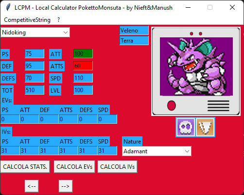

# LCPM - Local Calculator Pokemon 

PokemonCalculatorEVSIVS_Locale is a sophisticated suite of tools designed for Pokémon enthusiasts and experts alike. This cutting-edge software offers a wide range of features to optimize and maximize the potential of your Pokémon.

## Features

- **Pokémon Stats Calculator:** This powerful function allows you to calculate the statistics of any Pokémon, taking into account Natures, EVs, and IVs. Optimize your teams for maximum performance in battle.

- **Pokémon EVs Calculator:** Simplify the process of allocating Effort Values (EVs) to your Pokémon. With this function, you can determine exactly how to distribute EVs to maximize your team's performance.

- **Pokémon IVs Calculator:** With this invaluable function, you can identify and improve the Individual Values (IVs) of your Pokémon. Optimize base stats to obtain stronger and more competitive Pokémon.

- **Radar Chart Graph:** Visually represent your Pokémon's statistics through an intuitive radar chart. Monitor and compare your Pokémon's performance clearly and in detail.

- **Pokémon Icons:** Add a touch of personality to your software with iconic Pokémon images. Easily recognize your favorite Pokémon and customize the user experience.

- **Local Database:** PokemonCalculatorEVSIVS_Locale uses a local database, eliminating the need for an internet connection. Ensure the security and reliability of your data without compromise.

## Benefits

- **Professional and Reliable:** With a comprehensive and sophisticated suite of tools, PokemonCalculatorEVSIVS_Locale is the ideal choice for experts and businesses in the Pokémon industry.

- **Easy to Use:** Despite its advanced features, the software is designed to be intuitive and user-friendly. Optimize your team without any complications.

- **Customizable:** Adapt the software to your specific needs with various customization and configuration options.

## Screenshots

## Download

[LCPM.exe](LCPM_Executable)

## Contact

For more information or to request a demo, please contact us at corradotrigilia97@gmail.com | c.trigilia@sisoftsrl.it or visit our website at https://corryws.itch.io
